【重要数据】风格大逆转！但别着急！还要看持续性【20260529】

---

## 📄 各大指数估值分位点【20260529】(1).docx

各大指数估值分位点【20260529】

A500   上证指数

上证50

沪深300指数

中证500指数

中证1000指数

中证红利指数（股息率）

中证红利低波（股息率）

创业板指

科创50

中证全指

恒生指数

恒生科技指数

标普500指数纳斯达克100指数

---

## 🖼️ 各大指数估值分位点【20260529】(1).docx 图片提取

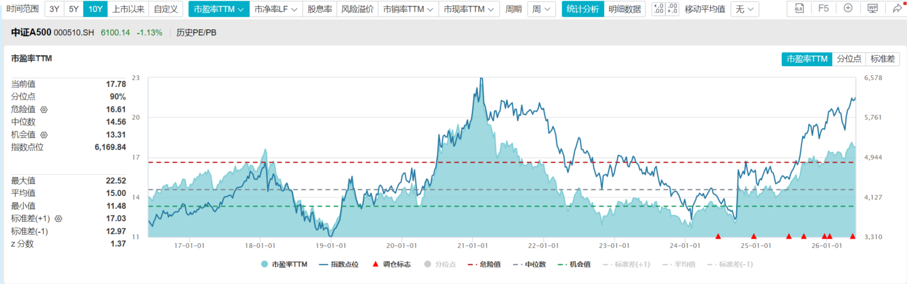

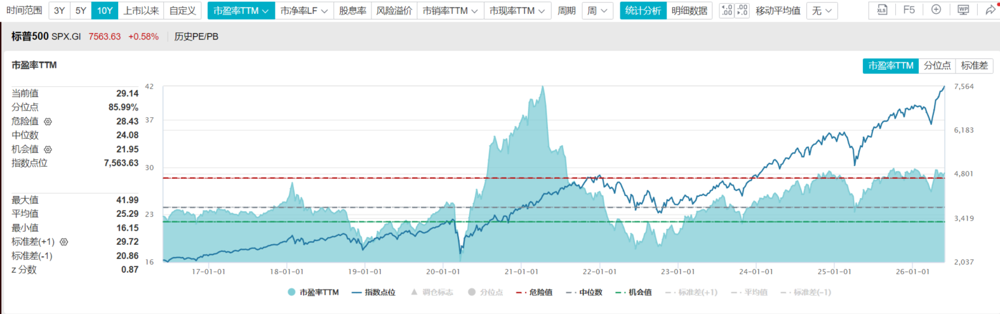

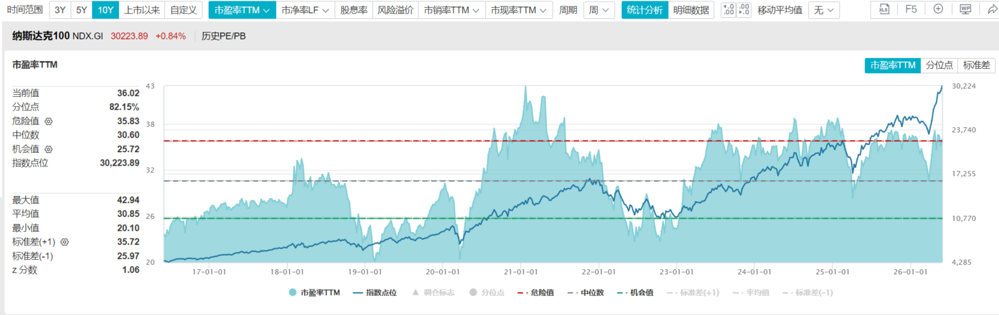

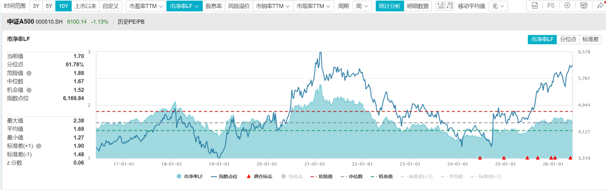

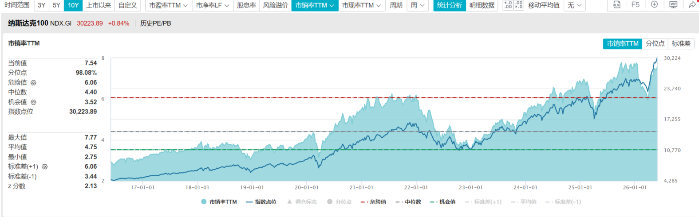

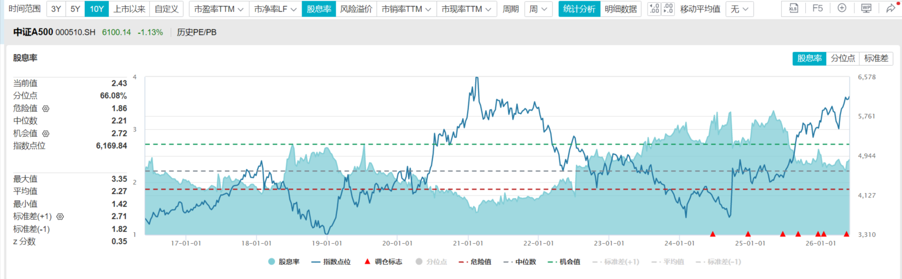

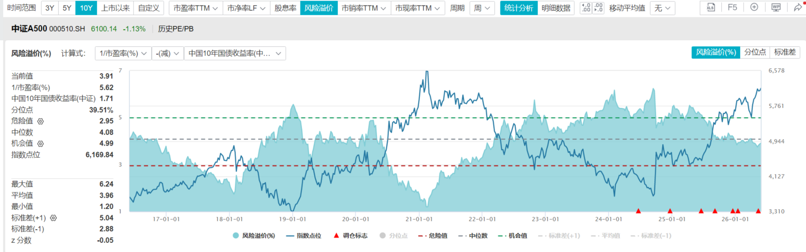

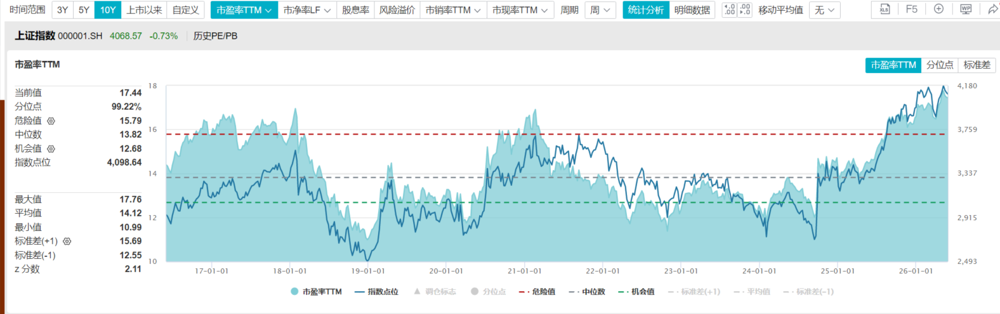

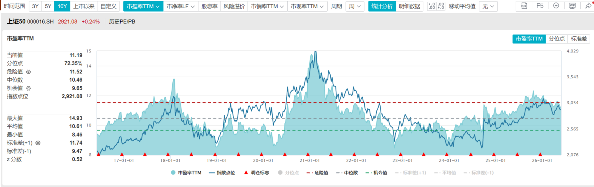

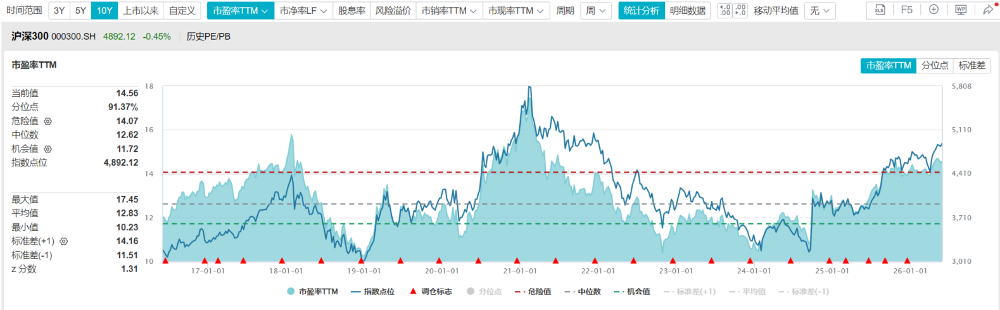

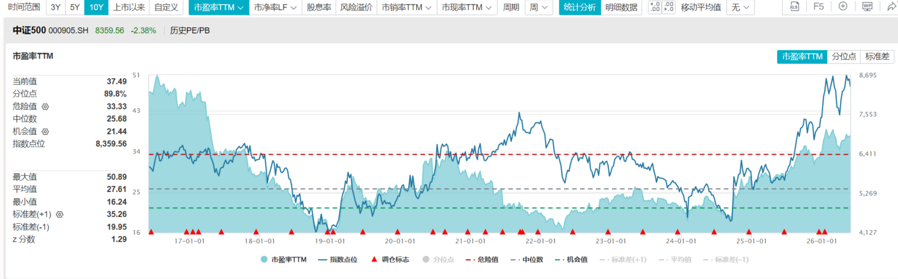

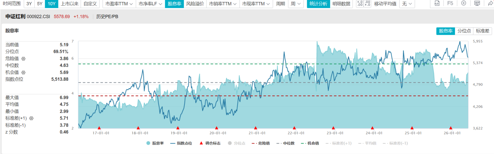

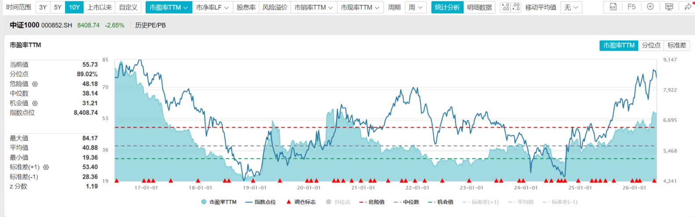

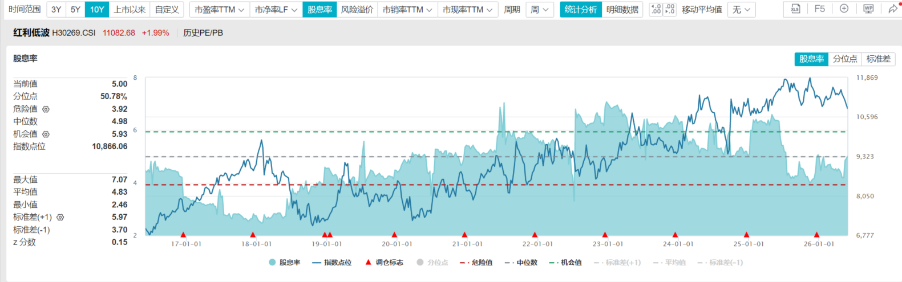

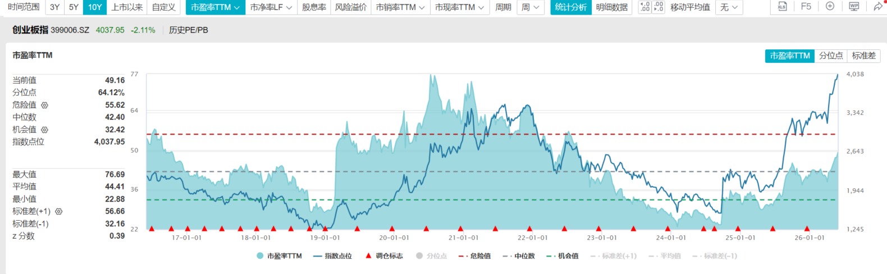

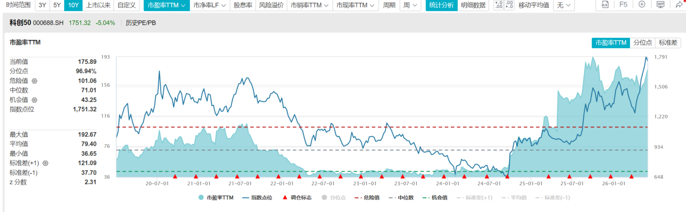

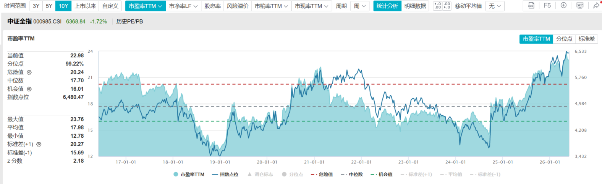

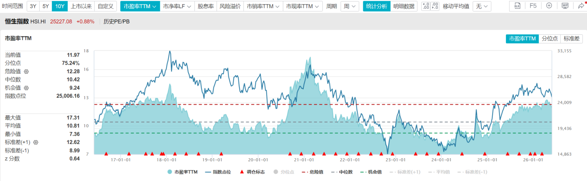

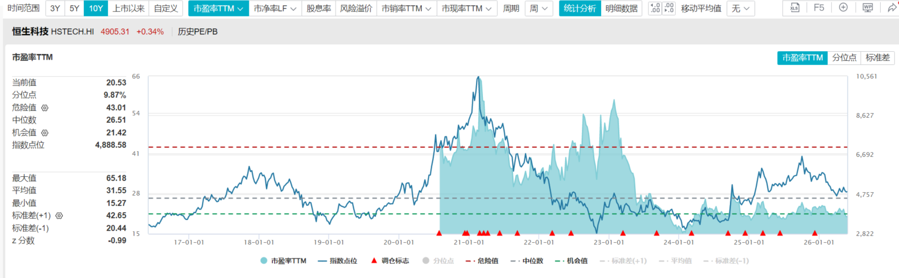

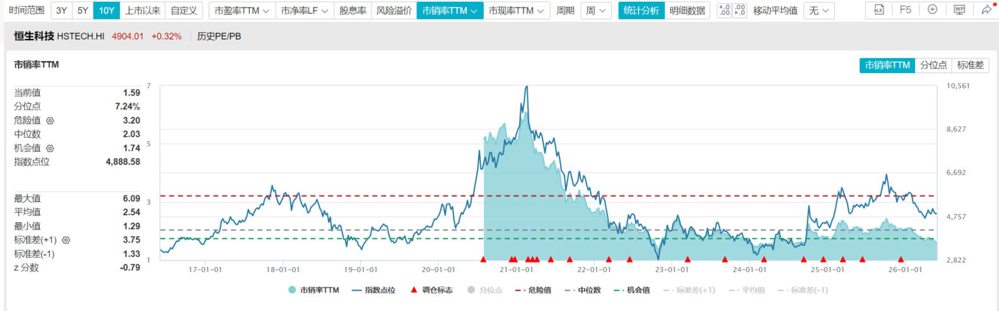

---

## 📄 【重要数据】风格大逆转！但别着急！还要看持续性【20260529】.docx

【重要数据】风格大逆转！但别着急！还要看持续性【20260529】

今天市场出现了久违的风格逆转，红利资产猛涨，长债也在涨，但是科技成长资产猛跌，科创50，今天一天跌出去5%，提醒大家一下，最高点回撤8%，对应的是1749点，今天盘中的时候，已经打穿。那些要动态止盈的，不知道你们是不是按照纪律执行。如果今天没来得及卖，下周也许还有机会。

很多人也都在问，是不是要风格反转了，看着有点像，因为今天红利这个涨幅确实很大，一天收回了一周的跌幅，而且成长价值，分化极度明显。但一天的行情，也很难说明问题，我们还需要继续观察。如果能连续几天，出现这种放量拉升价值资产的情况，市场可能就要风格逆转了。

之前我们其实也一直在提这个事，并不意外，因为成长价值的分化已经较为极端，确实该均值回归了，只是不知道他在哪均值回归，以什么方式进行回归而已。

今天的市场变化，也让本周行情骤变，中证全指开始考验长期均线组的支撑力，但仍然属于合理的调整范畴。上升趋势完好。

本周来看，上证指数跌了1.08%，全指跌了1.71%，300反而涨了0.97%， A500微跌0.25%，500 1000 2000跌幅较大，分别跌了2.53%，3.27%，5.29%，双创分化明显，创业板涨了2.53%，科创跌了2.2%，红利低波经过今天一天上涨，彻底扭转了下跌周上涨0.98%。所以本周是一个大盘强，小盘弱，价值强，成长弱的这么一个局面。

策略上，当下我们还是要坚持均衡，不追涨，也别过早和过多的抄底，市场都还不稳定。情况难以判断。未来市场调下来，监管会不会用指标股托底，稳住指数，在哪稳住指数，也都不确定。所以均衡一点，就会更踏实。

今天最后，赶紧老齐的核心投资理念，再给大家强调一下，希望大家赶紧学，尽快学，能学多少学多少，我们的投资理念，其实并不复杂，就三个维度。

把股市分成春夏秋冬，四类资产。春天就是经济不好，股市不错，涨的就是科技，夏天是经济好，股市也好，涨的就是消费与周期，秋天是经济到顶，股市开始回落，就是那些高股息和能源表现更好，而到了冬季， 股市跌，经济也在跌，那就只能持有长期债券。这就是春夏秋冬四季资产轮动的逻辑。

还可以把他再简化成2组，成长和价值，成长就是价差模式，主要是春夏资产，他是通过增速拉升估值，让我们低买高卖，赚取价差获取收益的，包括，科技，消费，周期，价值就是秋冬资产，属于收租模式，他是吃股息和票息的。包括金融，能源和债券，成长属于渣男，比较浪漫，容易讲故事，价值属于老实人，不会甜言蜜语，但却每时每刻都在大把赚钱。那么谈恋爱的时候，肯定渣男比较受欢迎，但当你遇上事了，能帮你渡过难关的还得是老实人。

当然我们还有第三个维度，那就是通过资金性质划分，对景气投资研究比较透彻的就是公募，所以有行业趋势爆发的时候，公募的主动投资，通常都会抱团。因为大家用的方法都一样。没有景气周期但股市还不错的时候，就是私募表现比较好，因为他们就爱做中小科技。这类股票吃题材，不吃业绩。又没景气周期，又没业绩的时候，就是保险资金最爱投的红利股和长债表现最好。

当你越是看不清方向的时候，你就越是要均配，当然这套框架，现在适用，未来若干年后，还适不适用，我也不知道。比如市场权重发生重大变化，或者指数化程度，量化程度到达一定水平。可能都会有新的影响。那就只能到时候再说了。我们也会持续跟随市场进化。

最近确实发生了一些事情。现在不方便讲，后面如果有机会，再跟大家倒倒苦水。我自己到是无所谓，就我现在这个消费能力，八辈子的钱都够用了。就是替群里的各位，感到有点悲哀。后面我们马上就会把宏观视频课，行业课和技术分析课，按照每天中午更新一集的速度，更新完毕为止，先把我们能给的，都给到大家。总之，我肯定竭尽所能，希望能跟大家继续走下去。争取不辜负大家的信任。

---

## 🖼️ 【重要数据】风格大逆转！但别着急！还要看持续性【20260529】.docx 图片提取

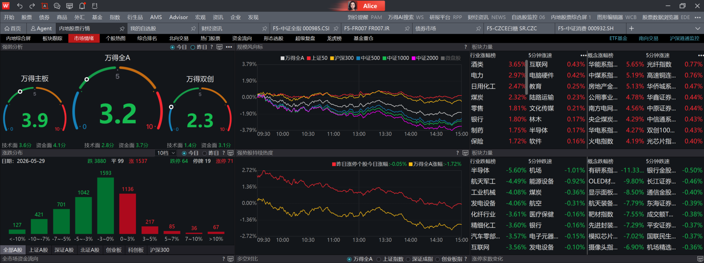

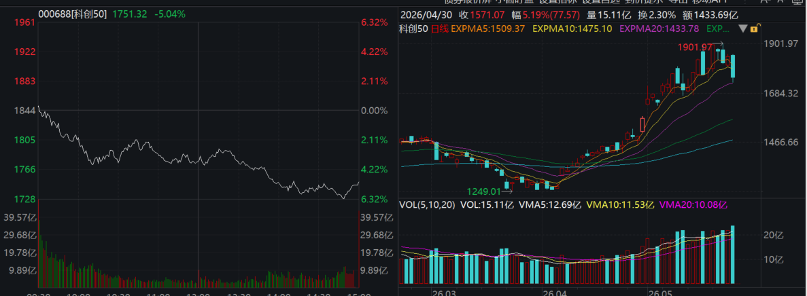

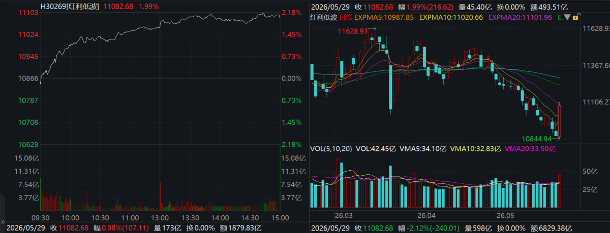

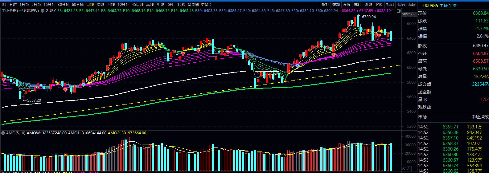

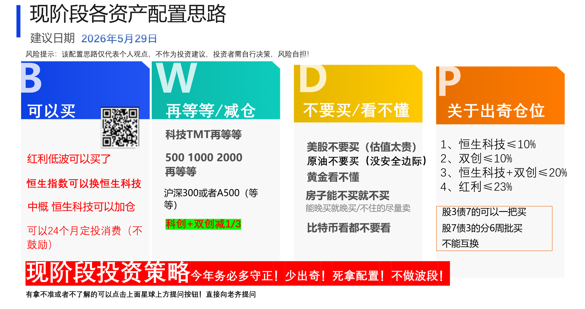

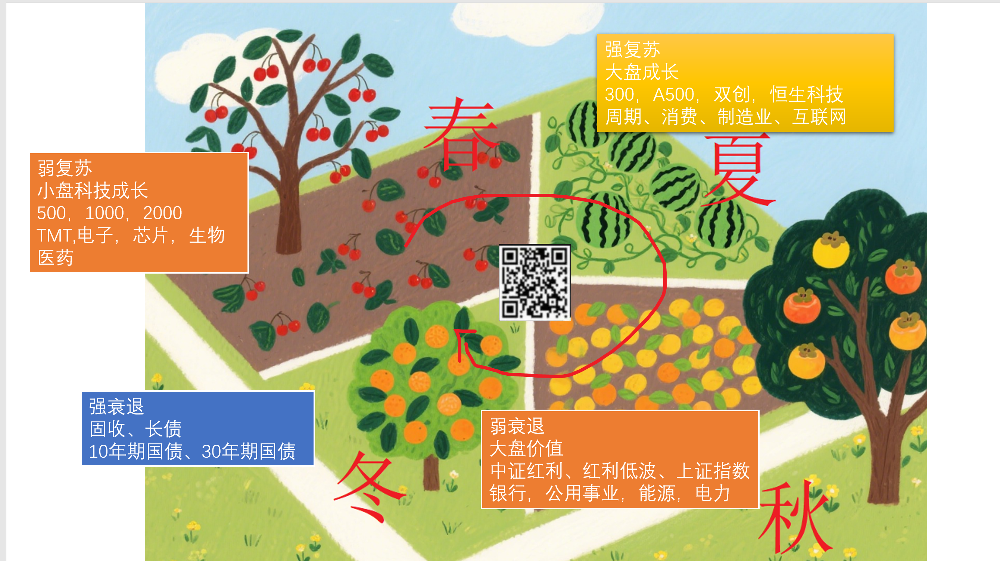

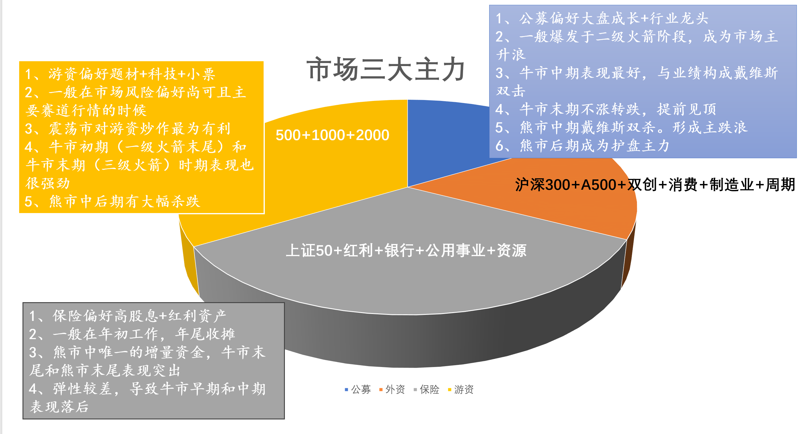

---

**📎 附件列表**:
- 【重要数据】风格大逆转！但别着急！还要看持续性【20260529】.mp3 (6770KB → `assets/qijunjie-fans/2026/05/29/【重要数据】风格大逆转！但别着急！还要看持续性【20260529】.mp3`) 🎙️ 语音
- 各大指数估值分位点【20260529】(1).docx (3958KB → `assets/qijunjie-fans/2026/05/29/各大指数估值分位点【20260529】(1).docx`) ✅ 已提取正文 🖼️ 20 张图
- 【重要数据】风格大逆转！但别着急！还要看持续性【20260529】.docx (5166KB → `assets/qijunjie-fans/2026/05/29/【重要数据】风格大逆转！但别着急！还要看持续性【20260529】.docx`) ✅ 已提取正文 🖼️ 7 张图
