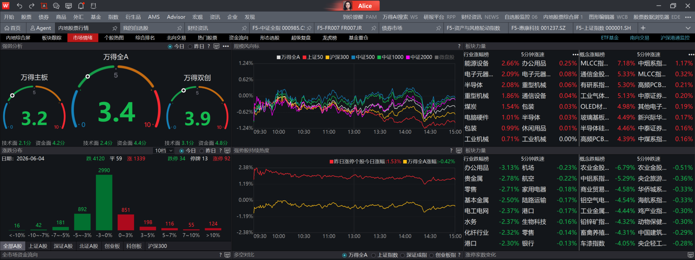
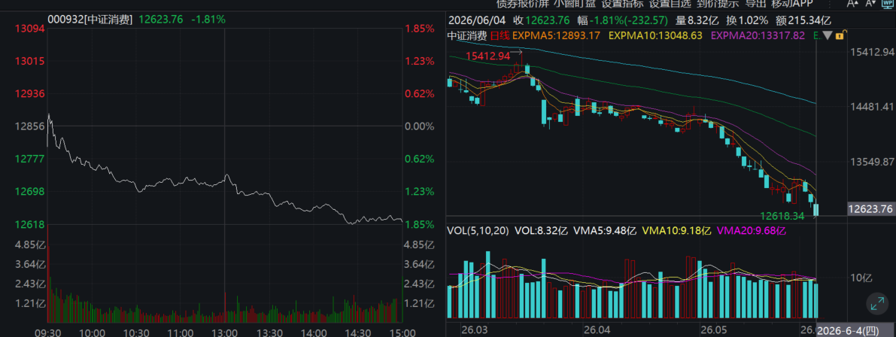
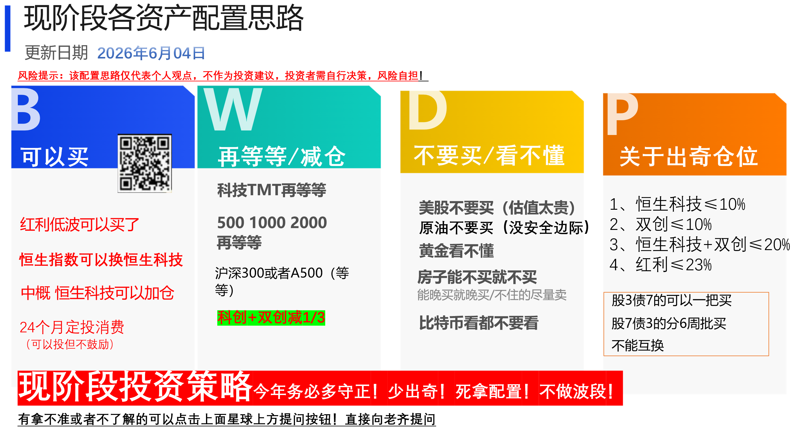
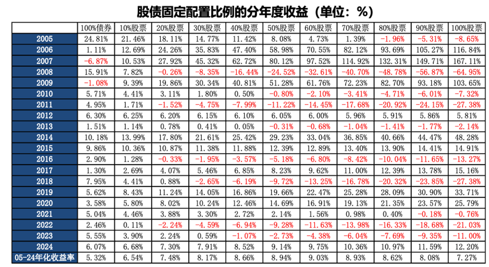
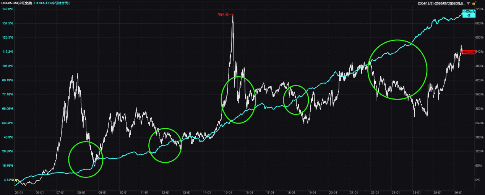
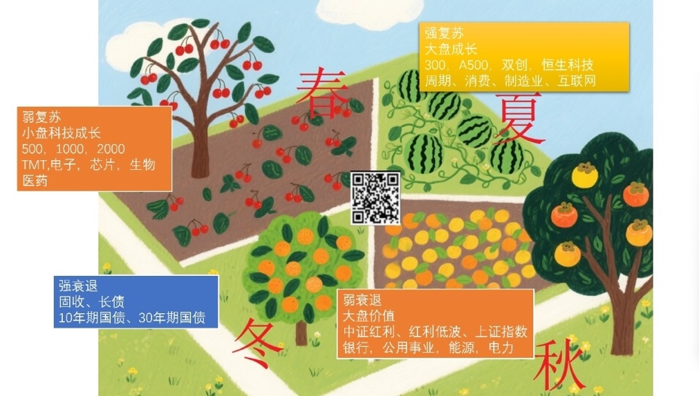
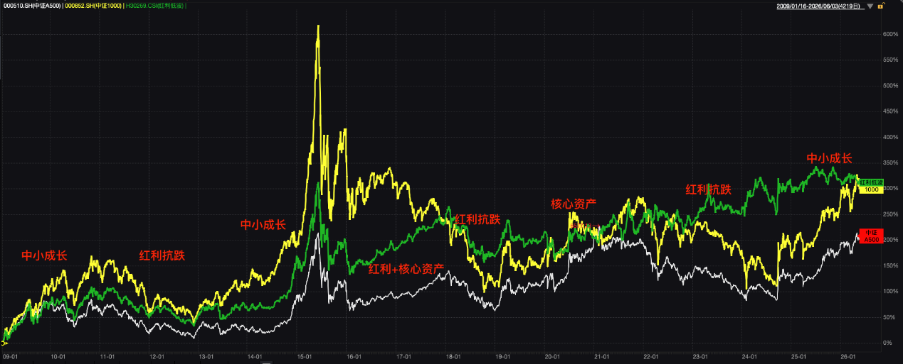
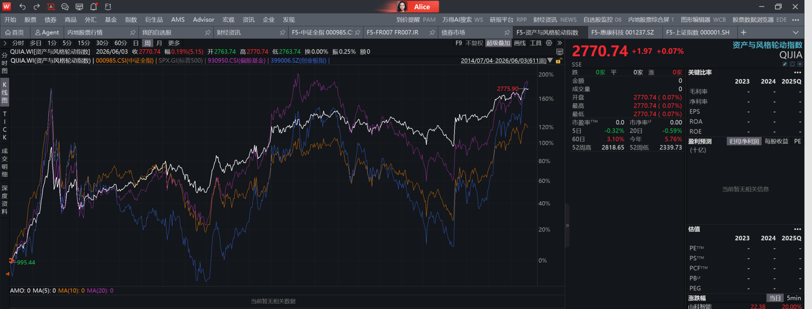

【学方法】股债两个维度，春夏秋冬四季资产！【20260604】

---

## 📄 【学方法】股债两个维度，春夏秋冬四季资产！【20260604】.docx

【学方法】股债两个维度，春夏秋冬四季资产！【20260604】

今天指数调整幅度不大，但是涨跌比却很糟糕，甚至越来越糟糕了，今天竟然4100家下跌。只有1300家上涨。收盘的时候，只有科创50的宽基指数是红的，其他都已经转绿。

消费继续暴跌1.8%，进一步创新低。再往下跌，就要奔2018年低点去了。这就有点恐怖了，那也就意味着还要跌20%。之所以消费现在这么悲观，是因为多因素共振造成的。1是收入预期无法改善，2是有出口撑着，政策也不着急，3是确实也办法不多。4是上游涨价，也开始挤压下游需求。所以最近一段时间，消费其实是在杀逻辑了，很可能要走最后一跌。会比较惨烈，但也会产生机会。所以要非买消费的，可以定投，慢点投，别着急。结合一个月不创新低的技巧来投。前期要控制好仓位。千万不要打到后面没子弹了。我觉得从速度来说，每个月不要超过1%。最好是别超过0.5%

从今年来看，做行业是很困难的，因为大多数行业都在下跌，但如果听我们的建议，实现均衡配置，到现在大体有6个点收益了。这也是我们的核心投资理念，

其实就2句话，股债两个维度，春夏秋冬四季资产。

首先是股债维度，从这张图中可以看到，并非满仓收益最高。过往来看，其实6成仓位再平衡，表现最佳。当然也因为过去10多年，债券票息比较高，股市表现欠佳。但未来票息不会这么高了，股市大概率比过去10年更好，所以我们觉得7成仓位可能更合适。

3成债券，我们形容为冬季资产。图中也可以看到，过往经济衰退，权益大跌的时候，债券通常都有不错表现。受益于央行降息，利率走低。而且中国制造大国，没有大通胀的背景下，很难出现股债双杀，顶多是短期流动性影响，很快会过去。因此，债券冬季资产的作用，就是用来做压舱石打底，留有后手，应对冬季衰退周期，跟股票资产做再平衡。

其次是风格维度，我们又把权益资产，拆分为了三大风格。分别对应春、夏、秋三个季节。

春季资产，代表指数就是中证1000，也包括中证500，2000，以及tmt电子芯片等行业。特征总结为几个词就是：科技高景气，中小成长，未来增速超预期，经济弱复苏，风险偏好驱动，量化私募和游资散户资金最爱参与。

夏季资产，代表指数是A500，也包括沪深300，周期制造消费等行业。双创和恒科其实春夏兼具。总结夏季资产的特征就是：核心资产，强者恒强，大盘成长，经济强复苏，也需要风险偏好驱动，公募资金最容易抱团方向，300和A500还是国家队ETF重点兜底对象。要向驱动这些资产往上走，需要经济复苏非常强劲才行。

秋季资产，代表指数就是红利类，银行，电力，公用事业等行业。总结特征就是：高股息收租模式，大盘价值，经济弱衰退，风险偏好回落，险资最喜欢投的方向。

2010年之后，A股风格周期开始出现明显变化。我们把这三大风格代表指数的历史走势，都拉出来，对照上面的特征总结，其实就非常明显了。

2010年牛市尾声，经济开始回落，但风险偏好还在，春季资产最后疯狂了一下。然后经济进入寒冬，秋季红利资产相对抗跌。随着利率回落，冬季债券资产上涨。2013年之后，经济一般，但有科技浪潮加持，杠杆资金大行其道，春季中小成长一飞冲天。2015年流动性泛滥，所有风格全部大涨，后面也集体大跌。但没有通胀，央行宽松，冬季债券资产还在上涨。2016年之后，供给侧改革配合棚改货币化，经济复苏出现力度，夏季和秋季资产都迎来上涨，春季小盘成长上波冲的太猛，还在走戴维斯双杀。最后外资引领公募，抱团夏季蓝筹核心资产。2018年贸易战，经济再度衰退，只有冬季债券资产上涨，春夏资产大跌，秋季红利相对抗跌。2019年之后，风格颠倒，经济进入强复苏，公募先抱团夏季资产，2021年之后切到春季资产。随后各种黑天鹅起飞，风险偏好急剧下降，经济进入刺骨寒冬，冬季债券资产迎来大牛市。秋季红利资产也率先回暖，明显抗跌，甚至逆势上涨。直到24年924之后，季节又转回春夏资产。

大家总觉得7成仓位会不会不够用，其实从历史表现来看，也就是那条白色的线，表现还是相当稳定的，十几年来，目前能超过这套策略的，也就是偏股基金的走势，也就是机构投资者的及格线，而且还是刚刚超过去，但是偏股的波动率则要大很多。如果你2015年或者2021年买在了高点，那么现在其实还没有解套。但是我们四季策略，却已经创出了新高，比2015年的高点多涨了50% 。比2021年的高点，也高出去15%，所以一直持有体验会好很多。每隔2-3年你就会发现，他比买国债和存银行要强不少，即便买在最高点，有个2-3年也会有超越固收的收益。

但这套策略，也有一个反人性的地方，就是无聊！短期要时刻接受自己平庸，每个阶段都做不了出头鸟，无法让你短期暴富，也很难体现英明神武。但经历几轮周期后，你就会发现，这种中庸、佛系、匀速的姿态，也是一种大智若愚的投资方式。符合慢即是快的投资哲学，

---

## 🖼️ 【学方法】股债两个维度，春夏秋冬四季资产！【20260604】.docx 图片提取

---

**📎 附件列表**:
- 【学方法】股债两个维度，春夏秋冬四季资产！【20260604】.docx (3817KB → `assets/qijunjie-fans/2026/06/04/【学方法】股债两个维度，春夏秋冬四季资产！【20260604】.docx`) ✅ 已提取正文 🖼️ 9 张图
- 【学方法】股债两个维度，春夏秋冬四季资产！【20260604】.mp3 (8610KB → `assets/qijunjie-fans/2026/06/04/【学方法】股债两个维度，春夏秋冬四季资产！【20260604】.mp3`) 🎙️ 语音
